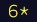

# Advent of Code 2015  </img>

In the words of its creator Eric Wastl:

*"<a href="https://adventofcode.com/">Advent of Code</a> is an Advent calendar of small programming puzzles for a variety of skill sets and skill levels that can be solved in any programming language you like. People use them as a speed contest, interview prep, company training, university coursework, practice problems, or to challenge each other."*

I began solving <a href="https://adventofcode.com/2015/">Advent of Code 2015</a> in R while teaching myself the language in January 2022.

## Stats & solutions

<table style="margin-left:auto; margin-right:auto">

  <tr>
    <td></td>
    <th style="text-align:center">Part 1</th>
    <th style="text-align:center">Part 2</th>
    <th style="text-align:center">New features used</th>
  </tr>

  <tr>
    <th scope="row"><a href="/solutions/day1/day1.r">Day 1</a></th>
    <td>22 Jan 2021</td>
    <td>22 Jan 2021</td>
    <td>`str_count`, `strsplit`, `for` loop, `if`/`if else`</td>
  </tr>

  <tr>
    <th scope="row"><a href="/solutions/day2/day2.r">Day 2</a></th>
    <td>22 Jan 2021</td>
    <td>22 Jan 2021</td>
    <td>`readLines`, functions, `as` for type conversion</td>
  </tr>

  <tr>
    <th scope="row"><a href="/solutions/day3/day3.r">Day 3</a></th>
    <td>23 Jan 2021</td>
    <td>23 Jan 2021</td>
    <td>`switch`, `unique` to get number of unique values</td>
  </tr>

  <tr>
    <th scope="row"><a href="/solutions/day4/day4.r">Day 4</a></th>
    <td>23 Jan 2021</td>
    <td>23 Jan 2021</td>
    <td>`md5` from <b>openssl</b> library, `paste` to concatenate strings</td>
  </tr>

  <tr>
    <th scope="row"><a href="/solutions/day5">Day 5</a></th>
    <td>23 Jan 2021</td>
    <td>23 Jan 2021</td>
    <td>`str_count` from <b>stringr</b> library with regular expressions</td>
  </tr>
</table>
